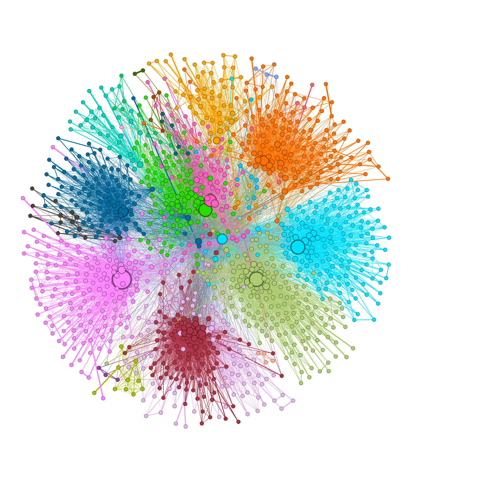

# 基于 Hadoop-MapReduce的人物关系挖掘

### 任务一 数据预处理:提取人名

本任务的主要工作是从原始的金庸小说文本中，抽取出与人物互动相关的数据，而屏蔽掉与人物关系无关的文本内容，为后面的基于人物共现的分析做准备。

输入:
> 狄云和戚芳一走到万家大宅之前，瞧见那高墙朱门、挂灯结彩的气派，心中都是暗自嘀咕。戚芳紧紧拉住了父亲的衣袖。戚长发正待向门公询问，忽见卜垣从门里出来，心中一喜，叫道：“卜贤侄，我来啦。”

输出:
> 狄云 戚芳 戚芳 戚长发 卜垣

### 任务二 特征抽取:人物同现统计

本任务的重要完成基于单词同现算法的人物同现统计。在人物同现分析中，如果两个人在原文的同一段落中出现，则认为两个人发生了一次同现关系。我们需要对人物之间的同现关系次数进行统计，同现关系次数越多，则说明两人的关系越密切。

输入:
> 狄云 戚芳 戚芳 戚长发 卜垣  
> 戚芳 卜垣 卜垣

输出:
> <狄云，戚芳> 1          <戚长发，狄云 > 1  
> <狄云，戚长发> 1        <戚长发，戚芳 > 1  
> <狄云，卜垣> 1          <戚长发，卜垣 > 1  
> <戚芳，狄云 > 1         <卜垣，狄云> 1  
> <戚芳，戚长发 > 1       <卜垣，戚芳> 2  
> <戚芳，卜垣 > 2         <卜垣，戚长发> 1  

### 任务三 特征处理:人物关系图构建与特征归一化

当获取了人物之间的共现关系之后，我们就可以根据共现关系，生成人物之间的关系图了。人物关系图使用邻接表的形式表示，方便后面的PageRank计算。在人物关系图中，人物是顶点，人物之间的互动关系是边。人物之间的互动关系靠人物之间的共现关系确定。如果两个人之间具有共现关系，则两个人之间就具有一条边。两人之间的共现次数体现出两人关系的密切程度，反映到共现关系图上就是边的权重。边的权重越高则体现了两个人的关系越密切。
为了使后面的方便分析，还需要对共现次数进行归一化处理：将共现次数转换为共现概率，具体的过程见后面的示例。

输入:
> <狄云，戚芳> 1          <戚长发，狄云 > 1  
> <狄云，戚长发> 1        <戚长发，戚芳 > 1  
> <狄云，卜垣> 1          <戚长发，卜垣 > 1  
> <戚芳，狄云 > 1         <卜垣，狄云> 1  
> <戚芳，戚长发 > 1       <卜垣，戚芳> 2  
> <戚芳，卜垣 > 2         <卜垣，戚长发> 1  

输出：
> 狄云 [戚芳,0.33333|戚长发，0.333333|卜垣0.333333]  
> 戚芳 [狄云,0.25 |戚长发，0.25|卜垣0.5]  
> 戚长发 [狄云,0.33333|戚芳，0.333333|卜垣0.333333]  
> 卜垣 [狄云0.25|戚芳,0.5|戚长发，0.25]

### 任务四 数据分析：基于人物关系图的PageRank计算

在给出人物关系图之后，我们就可以对人物关系图进行一个数据分析。其中一个典型的分析任务是：PageRank值计算。通过计算PageRank，我们就可以定量地金庸武侠江湖中的“主角”们是哪些。

输入:
> 任务三的输出

输出:
> 人物的PageRank值

### 任务五 数据分析：在人物关系图上的标签传播

标签传播（Label Propagation）是一种半监督的图分析算法，他能为图上的顶点打标签，进行图顶点的聚类分析，从而在一张类似社交网络图中完成社区发现（Community Detection）。图1中人物顶点的颜色就是根据标签传播的结果进行的染色。

输入:
> 任务三的输出

输出:
> 人物的标签信息

### 任务六 可视化

使用[Gephi](https://gephi.org/)可视化PageRank和LPA的结果。  
PageRank值决定顶点大小，label决定结点颜色。

